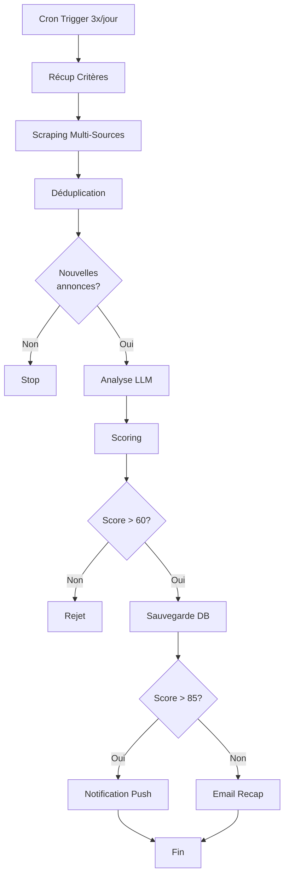

# Architecture Système - Meziane Monitoring

## 📋 Table des Matières
1. [Vue d'ensemble](#vue-densemble)
2. [Architecture en couches](#architecture-en-couches)
3. [Flux de données détaillés](#flux-de-données-détaillés)
4. [Domaines métier](#domaines-métier)
5. [Schéma d'architecture](#schéma-darchitecture)
6. [Pipeline de traitement](#pipeline-de-traitement)

---

## Vue d'ensemble

### Principes architecturaux
- **Séparation des responsabilités** : Chaque couche a un rôle précis
- **Single Source of Truth** : PostgreSQL comme base centrale
- **Event-driven** : Les changements de données déclenchent des traitements
- **Modulaire** : Chaque domaine métier est indépendant
- **Auditable** : Toutes les opérations sont tracées

### Stack Technique
- **Backend** : Python 3.11+ avec FastAPI
- **Base de données** : PostgreSQL 15+
- **Stockage documents** : S3/MinIO (compatible S3)
- **Cache** : Redis (pour performance)
- **Agents IA** : LangGraph + LangChain
- **Frontend** : Next.js 14 + React + TypeScript
- **Infra** : Docker + Docker Compose

---

## Architecture en Couches

```
┌─────────────────────────────────────────────────────────────────┐
│                      COUCHE PRÉSENTATION                         │
│  ┌────────────────┐  ┌────────────────┐  ┌────────────────┐    │
│  │   Dashboard    │  │   API REST     │  │   CLI Admin    │    │
│  │   Web (Next)   │  │   (FastAPI)    │  │                │    │
│  └────────────────┘  └────────────────┘  └────────────────┘    │
└─────────────────────────────────────────────────────────────────┘
                              ▼
┌─────────────────────────────────────────────────────────────────┐
│                      COUCHE AGENTS IA                            │
│  ┌────────────────┐  ┌────────────────┐  ┌────────────────┐    │
│  │ Agent          │  │ Agent          │  │ Agent Veille   │    │
│  │ Prospection    │  │ Analyse Bien   │  │ Réglementaire  │    │
│  └────────────────┘  └────────────────┘  └────────────────┘    │
│  ┌────────────────┐  ┌────────────────┐                        │
│  │ AgentOptim    │  │ Agent Gestion  │                        │
│  │ Fiscale        │  │ Locative       │                        │
│  └────────────────┘  └────────────────┘                        │
└─────────────────────────────────────────────────────────────────┘
                              ▼
┌─────────────────────────────────────────────────────────────────┐
│                    COUCHE MÉTIER (SERVICES)                      │
│  ┌────────────┐ ┌────────────┐ ┌────────────┐ ┌────────────┐  │
│  │ Patrimoine │ │ Comptable  │ │ Fiscalité  │ │ Cashflow   │  │
│  │ Service    │ │ Service    │ │ Service    │ │ Service    │  │
│  └────────────┘ └────────────┘ └────────────┘ └────────────┘  │
│  ┌────────────┐ ┌────────────┐ ┌────────────┐ ┌────────────┐  │
│  │ Acquisition│ │ Location   │ │ Document   │ │ Reporting  │  │
│  │ Service    │ │ Service    │ │ Service    │ │ Service    │  │
│  └────────────┘ └────────────┘ └────────────┘ └────────────┘  │
└─────────────────────────────────────────────────────────────────┘
                              ▼
┌─────────────────────────────────────────────────────────────────┐
│                   COUCHE INGESTION DONNÉES                       │
│  ┌────────────────┐  ┌────────────────┐  ┌────────────────┐    │
│  │ API Bancaire   │  │ Scraping Web   │  │ Upload Manuel  │    │
│  │ Connector      │  │ (Immobilier)   │  │ Documents      │    │
│  └────────────────┘  └────────────────┘  └────────────────┘    │
│  ┌────────────────┐  ┌────────────────┐                        │
│  │ OCR Engine     │  │ Parser         │                        │
│  │ (Documents)    │  │ (CSV, PDF)     │                        │
│  └────────────────┘  └────────────────┘                        │
└─────────────────────────────────────────────────────────────────┘
                              ▼
┌─────────────────────────────────────────────────────────────────┐
│                     COUCHE PERSISTENCE                           │
│  ┌────────────────────────────────────────────────────────┐    │
│  │              PostgreSQL (Données structurées)           │    │
│  │  - Transactions    - Biens      - Locataires           │    │
│  │  - SCI             - Documents  - Calculs fiscaux      │    │
│  └────────────────────────────────────────────────────────┘    │
│  ┌────────────────────────────────────────────────────────┐    │
│  │              S3/MinIO (Fichiers)                        │    │
│  │  - PDFs (statuts, KBIS, factures, relevés)             │    │
│  │  - Images (photos biens, diagnostics)                  │    │
│  └────────────────────────────────────────────────────────┘    │
│  ┌────────────────────────────────────────────────────────┐    │
│  │              Redis (Cache & Jobs)                       │    │
│  │  - Cache requêtes fréquentes                            │    │
│  │  - Queue jobs asynchrones                               │    │
│  └────────────────────────────────────────────────────────┘    │
└─────────────────────────────────────────────────────────────────┘
```

---

## Flux de Données Détaillés

### 🔄 Flux 1 : Ingestion Transactions Bancaires (Quotidien)

```
┌─────────────────┐
│  API Bancaire   │ (Bridge/Budget Insight)
│  (Banques SCI)  │
└────────┬────────┘
         │ 1. Récupération quotidienne automatique
         │    (Cron job : tous les jours à 6h00)
         ▼
┌─────────────────────────────────────┐
│  Banking Connector Service          │
│  - Authentification API              │
│  - Récupération transactions J-1     │
│  - Récupération soldes comptes       │
└────────┬────────────────────────────┘
         │ 2. Données brutes transactions
         ▼
┌─────────────────────────────────────┐
│  Transaction Parser                  │
│  - Normalisation format              │
│  - Extraction métadonnées            │
│  - Détection duplicatas              │
└────────┬────────────────────────────┘
         │ 3. Transactions normalisées
         ▼
┌─────────────────────────────────────┐
│  Transaction Categorizer (IA)       │
│  - Catégorisation automatique        │
│    • Loyer reçu                      │
│    • Charges copropriété             │
│    • Taxe foncière                   │
│    • Travaux                         │
│    • Remboursement crédit            │
│    • Honoraires gestion              │
│    • Assurances                      │
│  - Détection anomalies               │
│  - Suggestions associations          │
│    (transaction → bien → locataire)  │
└────────┬────────────────────────────┘
         │ 4. Transactions catégorisées
         ▼
┌─────────────────────────────────────┐
│  PostgreSQL                          │
│  Table: transactions                 │
│  - id, date, montant, libellé        │
│  - sci_id, categorie                 │
│  - bien_id, locataire_id (nullable)  │
│  - statut_validation                 │
└────────┬────────────────────────────┘
         │ 5. Event: TransactionCreated
         ▼
┌─────────────────────────────────────┐
│  Event Bus (Redis)                   │
│  Déclenche en cascade:               │
│  → Comptable Service                 │
│  → Cashflow Service                  │
│  → Reporting Service                 │
└─────────────────────────────────────┘
```

**Détails Traitement :**

| Étape | Responsabilité | Input | Output | Traitement |
|-------|---------------|-------|--------|------------|
| 1. Récupération | Banking Connector | Credentials API | Transactions brutes JSON | Appel API bancaire quotidien |
| 2. Parsing | Transaction Parser | JSON brut | Transactions normalisées | Mapping vers schéma interne |
| 3. Catégorisation | Categorizer (LLM) | Libellé transaction | Catégorie + confiance | Analyse NLP du libellé |
| 4. Persistence | Database Service | Transactions catégorisées | ID transaction | INSERT avec upsert |
| 5. Propagation | Event Bus | TransactionCreated | N/A | Publish event |

---

### 🔄 Flux 2 : Gestion Documentaire

```
┌─────────────────┐
│  Upload User    │ (Dashboard web ou email)
│  ou Email       │
└────────┬────────┘
         │ 1. Document brut (PDF, image, CSV)
         ▼
┌─────────────────────────────────────┐
│  Document Ingestion Service          │
│  - Validation format                 │
│  - Génération UUID                   │
│  - Stockage S3                       │
└────────┬────────────────────────────┘
         │ 2. Document stocké (URL S3)
         ▼
┌─────────────────────────────────────┐
│  Document Classification (IA)       │
│  Détection type:                     │
│  - Facture                           │
│  - Relevé bancaire                   │
│  - Avis taxe foncière                │
│  - Bail locatif                      │
│  - Diagnostic (DPE, amiante...)      │
│  - Statuts SCI                       │
│  - KBIS                              │
│  - Autre                             │
└────────┬────────────────────────────┘
         │ 3. Type détecté + confiance
         ▼
┌─────────────────────────────────────┐
│  OCR + Extraction Service            │
│  Selon type document:                │
│  - Facture → montant, date, émetteur│
│  - Taxe foncière → montant, bien     │
│  - Bail → loyer, dates, locataire    │
│  - Relevé → parsing transactions     │
└────────┬────────────────────────────┘
         │ 4. Métadonnées extraites
         ▼
┌─────────────────────────────────────┐
│  PostgreSQL                          │
│  Table: documents                    │
│  - id, type, s3_url, metadata_json   │
│  - sci_id, bien_id                   │
│  - date_document, uploaded_at        │
│  Table: document_extractions         │
│  - document_id, field, value         │
└────────┬────────────────────────────┘
         │ 5. Event: DocumentProcessed
         ▼
┌─────────────────────────────────────┐
│  Business Services                   │
│  - Facture → Comptable Service       │
│  - Taxe → Fiscalité Service          │
│  - Bail → Location Service           │
└─────────────────────────────────────┘
```

**Types de Documents & Traitement :**

| Type Document | Extraction Clés | Service Métier Impacté | Actions Auto |
|---------------|----------------|------------------------|--------------|
| Facture travaux | Montant, date, émetteur, TVA | Comptable | Création écriture comptable |
| Taxe foncière | Montant, bien, échéance | Fiscalité | Enregistrement charge |
| Bail locatif | Loyer, charges, dates, locataire | Location | Création contrat |
| Relevé bancaire | Liste transactions | Banking | Backup/vérification |
| Avis CFE/TVA | Montants, échéances | Fiscalité | Alerte paiement |
| Diagnostic DPE | Classe, date validité | Patrimoine | MAJ fiche bien |
| Statuts SCI | Capital, gérance | Patrimoine | MAJ infos SCI |

---

### 🔄 Flux 3 : Calculs Comptables & Fiscaux (Temps réel)

```
┌─────────────────┐
│  Event Bus      │
│  TransactionCreated
└────────┬────────┘
         │
         ▼
┌─────────────────────────────────────┐
│  Comptable Service                   │
│  Écoute événements transactions      │
└────────┬────────────────────────────┘
         │ 1. Récupération transaction
         ▼
┌─────────────────────────────────────┐
│  Règles Comptables Engine            │
│                                       │
│  Pour chaque transaction:             │
│                                       │
│  SI categorie = "Loyer reçu"          │
│    → Produit locatif (7XX)           │
│    → Impacte cashflow +              │
│    → Impacte déclaration 2072        │
│                                       │
│  SI categorie = "Taxe foncière"       │
│    → Charge déductible (6XX)         │
│    → Impacte cashflow -              │
│    → Impacte déclaration 2072        │
│                                       │
│  SI categorie = "Travaux"             │
│    → Vérif montant > 600€            │
│    → Si oui: Immobilisation          │
│    → Si non: Charge déductible       │
│    → Calcul amortissement            │
│                                       │
│  SI categorie = "Remb. crédit"        │
│    → Split capital/intérêts          │
│    → Intérêts = charge déductible    │
│    → Capital = réduction dette       │
└────────┬────────────────────────────┘
         │ 2. Écritures comptables
         ▼
┌─────────────────────────────────────┐
│  PostgreSQL                          │
│  Table: ecritures_comptables         │
│  - transaction_id                    │
│  - compte (plan comptable)           │
│  - debit / credit                    │
│  - exercice_fiscal                   │
│                                       │
│  Table: immobilisations               │
│  - bien_id, montant, date_acq        │
│  - duree_amortissement               │
│  - amortissement_annuel              │
└────────┬────────────────────────────┘
         │ 3. Event: ComptaUpdated
         ▼
┌─────────────────────────────────────┐
│  Fiscalité Service                   │
│  Recalcule en temps réel:            │
│  - Résultat fiscal par SCI           │
│  - Provisions 2072 (revenus fonciers)│
│  - CFE estimée                       │
│  - TVA si applicable                 │
└────────┬────────────────────────────┘
         │ 4. Métriques fiscales
         ▼
┌─────────────────────────────────────┐
│  PostgreSQL                          │
│  Table: calculs_fiscaux               │
│  - sci_id, exercice                  │
│  - revenus_fonciers                  │
│  - charges_deductibles               │
│  - resultat_fiscal                   │
│  - provision_impot                   │
└─────────────────────────────────────┘
```

**Règles Métier Comptables :**

| Transaction Type | Traitement Comptable | Impact Fiscal | Impact Cashflow |
|------------------|---------------------|---------------|-----------------|
| Loyer reçu | Produit (701) | Revenu foncier imposable | + Trésorerie |
| Charges copro | Charge (615) | Déductible à 100% | - Trésorerie |
| Taxe foncière | Charge (631) | Déductible à 100% | - Trésorerie |
| Travaux < 600€ | Charge (615) | Déductible immédiat | - Trésorerie |
| Travaux > 600€ | Immobilisation (21X) | Amortissement sur N années | - Trésorerie |
| Intérêts emprunt | Charge (661) | Déductible à 100% | - Trésorerie |
| Capital emprunt | Réduction dette (164) | Non déductible | - Trésorerie |
| Assurance PNO | Charge (616) | Déductible à 100% | - Trésorerie |
| Honoraires gestion | Charge (622) | Déductible à 100% | - Trésorerie |

---

### 🔄 Flux 4 : Calcul Cashflow & Liquidités (Temps réel)

```
┌─────────────────┐
│  Event Bus      │
│  TransactionCreated
└────────┬────────┘
         │
         ▼
┌─────────────────────────────────────┐
│  Cashflow Service                    │
│  Écoute événements transactions      │
└────────┬────────────────────────────┘
         │ 1. Récupération transaction
         ▼
┌─────────────────────────────────────┐
│  Cashflow Calculator                 │
│                                       │
│  Pour chaque SCI:                     │
│                                       │
│  Entrées (+):                         │
│  - Loyers encaissés                  │
│  - Remboursements (ex: dépôt garantie)│
│                                       │
│  Sorties (-):                         │
│  - Charges copro                     │
│  - Taxes                             │
│  - Travaux                           │
│  - Remboursements crédit (capital+int)│
│  - Assurances                        │
│  - Honoraires                        │
│                                       │
│  Cashflow Net = Entrées - Sorties    │
│                                       │
│  Liquidité = Solde compte bancaire   │
│            = Solde J-1 + Cashflow J  │
└────────┬────────────────────────────┘
         │ 2. Métriques calculées
         ▼
┌─────────────────────────────────────┐
│  PostgreSQL                          │
│  Table: cashflow_daily                │
│  - sci_id, date                      │
│  - entrees, sorties, net             │
│  - solde_bancaire                    │
│                                       │
│  Table: cashflow_metrics              │
│  - sci_id, mois                      │
│  - cashflow_moyen                    │
│  - liquidite_min, liquidite_max      │
│  - burn_rate (si négatif)            │
│                                       │
│  Vue matérialisée: cashflow_current   │
│  - sci_id                            │
│  - liquidite_actuelle                │
│  - cashflow_mtd (Month-to-date)      │
│  - cashflow_ytd (Year-to-date)       │
└────────┬────────────────────────────┘
         │ 3. Event: CashflowUpdated
         ▼
┌─────────────────────────────────────┐
│  Alert Service                       │
│  Vérifications:                      │
│  - Liquidité < seuil critique (5K€)  │
│  - Cashflow négatif 2 mois consécutifs│
│  - Impayé loyer détecté              │
│  → Notification utilisateur          │
└─────────────────────────────────────┘
```

**Métriques Cashflow Temps Réel :**

| Métrique | Formule | Fréquence Calcul | Usage |
|----------|---------|------------------|-------|
| Cashflow quotidien | Entrées J - Sorties J | Temps réel | Suivi au jour le jour |
| Cashflow mensuel | Somme cashflow quotidien mois M | Temps réel | Pilotage mensuel |
| Liquidité actuelle | Solde bancaire en temps réel | Temps réel | Capacité d'action |
| Burn rate | (Liquidité actuelle - Liquidité J-30) / 30 | Quotidien | Alerte si négatif |
| Runway | Liquidité / abs(Burn rate) si négatif | Quotidien | Nb jours avant tréso = 0 |
| Cashflow YTD | Cumul cashflow depuis 1er janvier | Temps réel | Performance annuelle |

---

### 🔄 Flux 5 : Analyse de Scénarios d'Investissement

```
┌─────────────────┐
│  User Input     │
│  (Dashboard)    │
│  - Prix bien    │
│  - Loyer estimé │
│  - Charges      │
│  - Apport       │
│  - Taux crédit  │
└────────┬────────┘
         │ 1. Paramètres simulation
         ▼
┌─────────────────────────────────────┐
│  Acquisition Service                 │
│  - Validation inputs                 │
│  - Récupération contexte SCI         │
│    (tréso dispo, capacité emprunt)   │
└────────┬────────────────────────────┘
         │ 2. Contexte enrichi
         ▼
┌─────────────────────────────────────┐
│  Simulation Engine                   │
│                                       │
│  Calculs:                             │
│                                       │
│  1. Financement:                      │
│     - Montant emprunt                │
│     - Mensualité (capital + intérêts)│
│     - Coût total crédit              │
│     - Assurance emprunteur           │
│                                       │
│  2. Rentabilité:                      │
│     - Rentabilité brute = Loyer/Prix │
│     - Charges annuelles totales      │
│     - Cashflow mensuel net           │
│     - Rentabilité nette              │
│                                       │
│  3. Fiscalité:                        │
│     - Impact sur revenus fonciers    │
│     - Charges déductibles            │
│     - Provision impôts               │
│                                       │
│  4. Projection long terme:            │
│     - TRI (Taux Rentabilité Interne) │
│     - VAN (Valeur Actuelle Nette)    │
│     - Cashflow cumulé sur 10/20 ans  │
│                                       │
│  5. Capacité d'emprunt:               │
│     - Taux endettement actuel        │
│     - Taux après acquisition         │
│     - Reste à vivre                  │
└────────┬────────────────────────────┘
         │ 3. Résultats simulation
         ▼
┌─────────────────────────────────────┐
│  IA Advisor                          │
│  Analyse multi-critères:             │
│  - Score rentabilité                 │
│  - Score risque                      │
│  - Score stratégique (vers obj 20)   │
│  → Recommandation: GO / NO GO / NEGO │
│  → Suggestions optimisation          │
│    (ex: négocier prix, quelle SCI    │
│     doit acheter, timing optimal)    │
└────────┬────────────────────────────┘
         │ 4. Rapport d'analyse
         ▼
┌─────────────────────────────────────┐
│  PostgreSQL                          │
│  Table: simulations_acquisition       │
│  - id, user_id, date                 │
│  - params_json (inputs)              │
│  - resultats_json (outputs)          │
│  - recommandation_ia                 │
│  - statut (simulé, en cours, réalisé)│
└────────┬────────────────────────────┘
         │ 5. Affichage Dashboard
         ▼
┌─────────────────────────────────────┐
│  Dashboard Web                       │
│  - Synthèse visuelle                 │
│  - Graphiques projection             │
│  - Comparaison avec patrimoine actuel│
│  - Actions: Sauvegarder / Partager   │
└─────────────────────────────────────┘
```

**Paramètres Simulation & Calculs :**

| Input Utilisateur | Calcul Automatique | Output Clé | Seuil Acceptable |
|-------------------|-------------------|------------|------------------|
| Prix bien | Frais notaire (8%) | Prix total acquisition | - |
| Loyer mensuel | Rentabilité brute (%) | Rentabilité brute | > 5% |
| Charges copro/mois | Total charges annuelles | Charges/loyer ratio | < 30% |
| Apport personnel | Montant emprunt | Taux endettement | < 33% |
| Taux crédit | Mensualité crédit | Cashflow net mensuel | > 0€ |
| Durée crédit | Coût total crédit | TRI sur 10 ans | > 8% |

---

### 🔄 Flux 6 : Agents IA Autonomes

#### Agent Prospection Immobilière

```
┌─────────────────┐
│  Cron Schedule  │ (Ex: 3x par jour - 8h, 14h, 20h)
└────────┬────────┘
         │
         ▼
┌─────────────────────────────────────┐
│  Agent Prospection                   │
│  Orchestrateur LangGraph             │
└────────┬────────────────────────────┘
         │ 1. Récupération critères recherche
         ▼
┌─────────────────────────────────────┐
│  PostgreSQL                          │
│  Table: criteres_recherche            │
│  - ville, arrondissement             │
│  - prix_min, prix_max                │
│  - surface_min                       │
│  - nb_pieces_min                     │
│  - rentabilite_min_attendue          │
│  - type_bien (appart, studio, etc)   │
└────────┬────────────────────────────┘
         │ 2. Critères actifs
         ▼
┌─────────────────────────────────────┐
│  Scraping Service                    │
│  Sources:                             │
│  - SeLoger (API ou scraping)         │
│  - PAP.fr                            │
│  - LeBonCoin                         │
│  - Bien'ici                          │
│  - Logic-Immo                        │
│                                       │
│  Filtres appliqués selon critères    │
└────────┬────────────────────────────┘
         │ 3. Annonces brutes (100-200)
         ▼
┌─────────────────────────────────────┐
│  Deduplication Service               │
│  - Détection doublons cross-sources  │
│  - Vérification si déjà analysé      │
│  → Garde uniquement nouvelles annonces│
└────────┬────────────────────────────┘
         │ 4. Nouvelles annonces (10-30)
         ▼
┌─────────────────────────────────────┐
│  Agent Analyse (LLM)                 │
│  Pour chaque annonce:                │
│                                       │
│  1. Extraction données:               │
│     - Prix, surface, pièces          │
│     - Adresse précise                │
│     - DPE                            │
│     - Charges copro                  │
│                                       │
│  2. Estimation loyer:                 │
│     - API DVF (prix marché)          │
│     - Comparables quartier           │
│     → Loyer estimé                   │
│                                       │
│  3. Calcul rentabilité rapide:        │
│     - Rentabilité brute              │
│     - Rentabilité nette estimée      │
│                                       │
│  4. Scoring:                          │
│     - Score rentabilité (0-100)      │
│     - Score emplacement (0-100)      │
│     - Score état (0-100)             │
│     → Score global                   │
└────────┬────────────────────────────┘
         │ 5. Annonces scorées
         ▼
┌─────────────────────────────────────┐
│  Filtering & Ranking                 │
│  - Garde score > 60/100              │
│  - Tri par score décroissant         │
│  - Top 10 annonces                   │
└────────┬────────────────────────────┘
         │ 6. Top opportunités
         ▼
┌─────────────────────────────────────┐
│  PostgreSQL                          │
│  Table: opportunites_immobilieres     │
│  - id, url_annonce, source           │
│  - prix, surface, ville              │
│  - loyer_estime, rentabilite_brute   │
│  - score_global                      │
│  - date_detection                    │
│  - statut (nouveau, vu, contacté,    │
│            visite_programmée, rejeté)│
└────────┬────────────────────────────┘
         │ 7. Event: NewOpportunityDetected
         ▼
┌─────────────────────────────────────┐
│  Notification Service                │
│  - Email recap quotidien             │
│  - Push notification si score > 85   │
│  - Dashboard: pastille "10 nouvelles"│
└─────────────────────────────────────┘
```

**Workflow Agent Prospection :**



#### Agent Veille Réglementaire

```
┌─────────────────┐
│  Cron Schedule  │ (1x par semaine - Lundi 9h)
└────────┬────────┘
         │
         ▼
┌─────────────────────────────────────┐
│  Agent Veille Réglementaire          │
│  Orchestrateur LangGraph             │
└────────┬────────────────────────────┘
         │ 1. Définition périmètre veille
         ▼
┌─────────────────────────────────────┐
│  Veille Topics                       │
│  - Loi fiscalité immobilière         │
│  - Réglementation copropriété        │
│  - Encadrement loyers (Paris)        │
│  - Normes DPE                        │
│  - SCI : modifications cadre légal   │
│  - Fiscalité revenus fonciers        │
└────────┬────────────────────────────┘
         │ 2. Topics à surveiller
         ▼
┌─────────────────────────────────────┐
│  Multi-Source Crawler                │
│  Sources officielles:                │
│  - Légifrance (JO)                   │
│  - Service-public.fr                 │
│  - Impots.gouv.fr                    │
│  - ANIL                              │
│  Sources expert:                     │
│  - Meilleurtaux (blog immo)          │
│  - Nexity (actus)                    │
│  - Boursorama Immo                   │
└────────┬────────────────────────────┘
         │ 3. Articles/publications récentes
         ▼
┌─────────────────────────────────────┐
│  LLM Analyzer                        │
│  Pour chaque contenu:                │
│  1. Résumé en français               │
│  2. Détection impact:                │
│     - Aucun                          │
│     - Faible                         │
│     - Modéré                         │
│     - Fort                           │
│  3. Analyse spécifique:              │
│     - Impact sur SCI Bilal?          │
│     - Actions requises?              │
│     - Deadline?                      │
└────────┬────────────────────────────┘
         │ 4. Infos catégorisées
         ▼
┌─────────────────────────────────────┐
│  PostgreSQL                          │
│  Table: veille_reglementaire          │
│  - id, titre, source, date_publi     │
│  - resume, impact_level              │
│  - actions_recommandees              │
│  - deadline                          │
│  - statut (nouveau, lu, traité)      │
└────────┬────────────────────────────┘
         │ 5. Notification si impact Modéré/Fort
         ▼
┌─────────────────────────────────────┐
│  Alert Service                       │
│  - Email détaillé                    │
│  - Dashboard: section "Alertes régl."│
└─────────────────────────────────────┘
```

---

## Domaines Métier

### 1. **Patrimoine Service**

**Responsabilité** : Gestion du portefeuille immobilier (SCI, biens)

**Entités gérées** :
- SCI (identité, statuts, capital, gérants)
- Biens immobiliers (adresse, surface, type, valeur)
- Valorisation patrimoine

**Opérations** :
- CRUD SCI et biens
- Calcul valeur patrimoniale totale
- Projection évolution patrimoine
- Tracking objectif "20 appartements d'ici 2030"

**Tables PostgreSQL** :
```sql
-- SCI
sci (id, nom, forme_juridique, siret, date_creation, capital, siege_social, gerant_id)

-- Biens
biens (id, sci_id, adresse, ville, cp, surface, nb_pieces, type_bien,
       date_acquisition, prix_acquisition, valeur_actuelle, dpe_classe, statut)

-- Valorisation
valorisations_patrimoine (id, date_valorisation, valeur_totale,
                          nb_biens, surface_totale, loyers_annuels_potentiels)
```

---

### 2. **Comptable Service**

**Responsabilité** : Tenue comptabilité, écritures, plan comptable

**Entités gérées** :
- Transactions bancaires
- Écritures comptables (débit/crédit)
- Immobilisations et amortissements
- Exercices fiscaux

**Opérations** :
- Enregistrement écritures comptables
- Calcul amortissements
- Génération balance comptable
- Export FEC (Fichier Écritures Comptables)

**Tables PostgreSQL** :
```sql
-- Transactions
transactions (id, sci_id, compte_bancaire_id, date, montant, libelle,
              categorie, bien_id, locataire_id, statut_validation)

-- Écritures comptables
ecritures_comptables (id, transaction_id, exercice_fiscal, compte_pcg,
                      libelle, debit, credit, date_ecriture)

-- Immobilisations
immobilisations (id, bien_id, libelle, date_acquisition, montant_ht,
                 duree_amortissement, amortissement_cumule)
```

---

### 3. **Fiscalité Service**

**Responsabilité** : Calculs fiscaux, déclarations, optimisation

**Entités gérées** :
- Revenus fonciers
- Charges déductibles
- Résultat fiscal
- Déclarations (2072, CFE, etc.)

**Opérations** :
- Calcul revenus fonciers nets
- Calcul provision impôt sur le revenu
- Génération préremplissage 2072
- Simulation optimisation fiscale

**Tables PostgreSQL** :
```sql
-- Calculs fiscaux
calculs_fiscaux (id, sci_id, exercice, revenus_fonciers_bruts,
                 charges_deductibles, resultat_fiscal, provision_impot)

-- Déclarations
declarations_fiscales (id, sci_id, annee, type_declaration,
                       date_generation, statut, fichier_pdf_url)
```

---

### 4. **Cashflow Service**

**Responsabilité** : Suivi trésorerie, liquidités, projections

**Entités gérées** :
- Flux de trésorerie quotidiens
- Soldes bancaires
- Métriques cashflow
- Alertes trésorerie

**Opérations** :
- Calcul cashflow quotidien/mensuel/annuel
- Suivi liquidité en temps réel
- Détection anomalies (burn rate)
- Projection trésorerie

**Tables PostgreSQL** :
```sql
-- Cashflow quotidien
cashflow_daily (id, sci_id, date, entrees, sorties, cashflow_net, solde_bancaire)

-- Métriques
cashflow_metrics (id, sci_id, mois, cashflow_moyen, liquidite_min,
                  liquidite_max, burn_rate)

-- Vue matérialisée
CREATE MATERIALIZED VIEW cashflow_current AS
SELECT sci_id,
       MAX(solde_bancaire) AS liquidite_actuelle,
       SUM(CASE WHEN date >= date_trunc('month', CURRENT_DATE)
           THEN cashflow_net ELSE 0 END) AS cashflow_mtd
FROM cashflow_daily
GROUP BY sci_id;
```

---

### 5. **Acquisition Service**

**Responsabilité** : Analyse opportunités, simulations investissement

**Entités gérées** :
- Opportunités détectées (scraping)
- Simulations acquisition
- Critères de recherche

**Opérations** :
- Simulation financement et rentabilité
- Calcul TRI, VAN
- Recommandation IA (GO/NO GO)
- Comparaison scénarios

**Tables PostgreSQL** :
```sql
-- Opportunités
opportunites_immobilieres (id, url_annonce, source, prix, surface, ville,
                           loyer_estime, rentabilite_brute, score_global,
                           date_detection, statut)

-- Simulations
simulations_acquisition (id, user_id, date, opportunite_id,
                         params_json, resultats_json, recommandation_ia, statut)

-- Critères recherche
criteres_recherche (id, actif, ville, prix_min, prix_max, surface_min,
                    nb_pieces_min, rentabilite_min_attendue)
```

---

### 6. **Location Service**

**Responsabilité** : Gestion locataires, baux, loyers

**Entités gérées** :
- Locataires
- Baux locatifs
- Quittances de loyer
- Impayés

**Opérations** :
- Suivi baux (début, fin, renouvellement)
- Génération quittances
- Détection impayés
- Alertes fin de bail

**Tables PostgreSQL** :
```sql
-- Locataires
locataires (id, nom, prenom, email, telephone, date_naissance,
            profession, revenus_annuels)

-- Baux
baux_locatifs (id, bien_id, locataire_id, date_debut, date_fin,
               loyer_mensuel, charges_mensuelles, depot_garantie, statut)

-- Quittances
quittances_loyer (id, bail_id, mois, montant, date_paiement, statut)
```

---

### 7. **Document Service**

**Responsabilité** : Gestion documentaire, OCR, classification

**Entités gérées** :
- Documents (PDF, images)
- Métadonnées extraites
- Classifications

**Opérations** :
- Upload et stockage S3
- Classification automatique (IA)
- OCR et extraction données
- Recherche documentaire

**Tables PostgreSQL** :
```sql
-- Documents
documents (id, sci_id, bien_id, type_document, s3_url,
           date_document, uploaded_at, metadata_json)

-- Extractions
document_extractions (id, document_id, field_name, field_value, confidence_score)
```

---

### 8. **Reporting Service**

**Responsabilité** : Génération rapports, KPIs, visualisations

**Entités gérées** :
- Rapports prédéfinis
- KPIs métier
- Exports (PDF, Excel)

**Opérations** :
- Génération rapport mensuel SCI
- Calcul KPIs (rentabilité, taux occupation, etc.)
- Export données comptables
- Dashboards temps réel

**Tables PostgreSQL** :
```sql
-- Rapports
rapports (id, type_rapport, sci_id, periode_debut, periode_fin,
          genere_at, fichier_url)

-- KPIs
kpis_snapshot (id, date_snapshot, sci_id,
               rentabilite_brute, rentabilite_nette, taux_occupation,
               cashflow_mensuel_moyen, liquidite_disponible)
```

---

## Schéma d'Architecture Globale

```
┌─────────────────────────────────────────────────────────────────────────────┐
│                           UTILISATEUR (Bilal)                                │
│                                                                              │
│  ┌──────────────────┐         ┌──────────────────┐                          │
│  │  Dashboard Web   │         │  Mobile App      │                          │
│  │  (Next.js)       │         │  (Future)        │                          │
│  └────────┬─────────┘         └────────┬─────────┘                          │
└───────────┼──────────────────────────────┼────────────────────────────────────┘
            │                              │
            └──────────────┬───────────────┘
                           │ HTTPS/REST
                           ▼
┌─────────────────────────────────────────────────────────────────────────────┐
│                           API GATEWAY (FastAPI)                              │
│  - Authentification JWT                                                      │
│  - Rate limiting                                                             │
│  - Logging/Monitoring                                                        │
└────────┬─────────────────────────────────────────────────────────────────────┘
         │
         ▼
┌─────────────────────────────────────────────────────────────────────────────┐
│                         BUSINESS SERVICES LAYER                              │
│                                                                              │
│  ┌────────────┐ ┌────────────┐ ┌────────────┐ ┌────────────┐              │
│  │ Patrimoine │ │ Comptable  │ │ Fiscalité  │ │ Cashflow   │              │
│  └────────────┘ └────────────┘ └────────────┘ └────────────┘              │
│  ┌────────────┐ ┌────────────┐ ┌────────────┐ ┌────────────┐              │
│  │Acquisition │ │ Location   │ │ Document   │ │ Reporting  │              │
│  └────────────┘ └────────────┘ └────────────┘ └────────────┘              │
│                                                                              │
│  Communication: Event Bus (Redis Pub/Sub)                                   │
└────────┬─────────────────────────────────────────────────────────────────────┘
         │
         ▼
┌─────────────────────────────────────────────────────────────────────────────┐
│                              AI AGENTS LAYER                                 │
│                                                                              │
│  ┌──────────────────────┐        ┌──────────────────────┐                  │
│  │ Agent Prospection    │        │ Agent Analyse Bien   │                  │
│  │ - Scraping immo      │        │ - Scoring            │                  │
│  │ - Déduplication      │        │ - Rentabilité        │                  │
│  └──────────────────────┘        └──────────────────────┘                  │
│                                                                              │
│  ┌──────────────────────┐        ┌──────────────────────┐                  │
│  │ Agent Veille Régl.   │        │ Agent Optim Fiscale  │                  │
│  │ - Crawler légal      │        │ - Simulations        │                  │
│  │ - Analyse impact     │        │ - Recommandations    │                  │
│  └──────────────────────┘        └──────────────────────┘                  │
│                                                                              │
│  ┌──────────────────────┐                                                   │
│  │ Agent Gestion Loc.   │                                                   │
│  │ - Suivi baux         │                                                   │
│  │ - Alertes            │                                                   │
│  └──────────────────────┘                                                   │
│                                                                              │
│  Framework: LangGraph + LangChain + Claude/GPT-4                            │
└────────┬─────────────────────────────────────────────────────────────────────┘
         │
         ▼
┌─────────────────────────────────────────────────────────────────────────────┐
│                         DATA INGESTION LAYER                                 │
│                                                                              │
│  ┌──────────────────┐  ┌──────────────────┐  ┌──────────────────┐          │
│  │ Banking API      │  │ Web Scraping     │  │ Document Upload  │          │
│  │ Connector        │  │ Service          │  │ Service          │          │
│  │ (Bridge/BI)      │  │ (Selenium/Scrapy)│  │ (Drag&drop/Email)│          │
│  └────────┬─────────┘  └────────┬─────────┘  └────────┬─────────┘          │
│           │                     │                     │                     │
│           └──────────┬──────────┴──────────┬──────────┘                     │
│                      ▼                     ▼                                │
│           ┌──────────────────┐  ┌──────────────────┐                        │
│           │ Parser Service   │  │ OCR Engine       │                        │
│           │ (Transactions)   │  │ (Tesseract/Cloud)│                        │
│           └──────────────────┘  └──────────────────┘                        │
└────────┬─────────────────────────────────────────────────────────────────────┘
         │
         ▼
┌─────────────────────────────────────────────────────────────────────────────┐
│                            PERSISTENCE LAYER                                 │
│                                                                              │
│  ┌───────────────────────────────────────────────────────────────┐          │
│  │                     PostgreSQL 15                             │          │
│  │  Tables: sci, biens, transactions, ecritures_comptables,      │          │
│  │          calculs_fiscaux, cashflow_daily, documents, ...      │          │
│  └───────────────────────────────────────────────────────────────┘          │
│                                                                              │
│  ┌───────────────────────────────────────────────────────────────┐          │
│  │                     S3 / MinIO                                │          │
│  │  Buckets: documents-sci, rapports, exports                    │          │
│  └───────────────────────────────────────────────────────────────┘          │
│                                                                              │
│  ┌───────────────────────────────────────────────────────────────┐          │
│  │                     Redis                                     │          │
│  │  - Cache (soldes, KPIs)                                       │          │
│  │  - Pub/Sub (Event Bus)                                        │          │
│  │  - Queue jobs (Celery)                                        │          │
│  └───────────────────────────────────────────────────────────────┘          │
└─────────────────────────────────────────────────────────────────────────────┘


┌─────────────────────────────────────────────────────────────────────────────┐
│                          EXTERNAL SERVICES                                   │
│                                                                              │
│  ┌──────────────┐  ┌──────────────┐  ┌──────────────┐  ┌──────────────┐   │
│  │ Bridge/BI    │  │ SeLoger API  │  │ DVF API      │  │ LLM APIs     │   │
│  │ (Banking)    │  │ (Annonces)   │  │ (Prix marché)│  │ (Claude/GPT) │   │
│  └──────────────┘  └──────────────┘  └──────────────┘  └──────────────┘   │
│                                                                              │
│  ┌──────────────┐  ┌──────────────┐                                         │
│  │ Email SMTP   │  │ Push Notif   │                                         │
│  │ (Alerts)     │  │ Service      │                                         │
│  └──────────────┘  └──────────────┘                                         │
└─────────────────────────────────────────────────────────────────────────────┘
```

---

## Pipeline de Traitement - Vue Chronologique

### Journée Type du Système

```
00:00 - Minuit
├─ Sauvegarde base de données (backup automatique)
├─ Génération rapports quotidiens
└─ Calcul KPIs consolidés J-1

06:00 - Matin
├─ Récupération transactions bancaires J-1 (API Banking)
│  └─> Parsing → Catégorisation IA → Stockage DB
│      └─> Déclenchement calculs comptables
│          └─> Mise à jour cashflow
│              └─> Alertes si anomalies

08:00
├─ Agent Prospection Immobilière - Run 1/3
│  └─> Scraping annonces → Analyse → Scoring → Stockage
│      └─> Notification si opportunité score > 85

09:00 (Lundi uniquement)
├─ Agent Veille Réglementaire
│  └─> Crawling sources légales → Analyse impact → Alertes

12:00
├─ Refresh vues matérialisées PostgreSQL
│  (cashflow_current, kpis_snapshot)

14:00
├─ Agent Prospection Immobilière - Run 2/3

18:00
├─ Génération rapport de fin de journée
│  └─> Synthèse transactions J
│  └─> Cashflow net J
│  └─> Nouvelles opportunités détectées

20:00
├─ Agent Prospection Immobilière - Run 3/3
└─ Email récapitulatif quotidien envoyé
```

### Pipeline Mensuel (1er de chaque mois)

```
1er du mois - 07:00
├─ Calcul cashflow mois M-1
├─ Calcul rentabilité mensuelle par bien
├─ Génération rapport mensuel SCI
│  └─> Revenus vs charges
│  └─> Cashflow net
│  └─> Taux occupation
│  └─> Projection vs objectif annuel
├─ Vérification échéances (baux, crédits)
└─ Alertes actions requises mois M
```

### Pipeline Annuel (1er janvier)

```
1er janvier - 08:00
├─ Clôture exercice fiscal N-1
├─ Calcul définitif revenus fonciers N-1
├─ Génération données préremplies déclaration 2072
├─ Calcul TRI / rentabilité annuelle par bien
├─ Rapport annuel global patrimoine
│  └─> Évolution valeur patrimoniale
│  └─> Performance vs objectifs
│  └─> Recommandations stratégiques année N
└─> Archivage documents année N-1
```

---

## Dépendances & Communication Inter-Services

### Graphe de Dépendances

```
Banking Connector
    │
    ├─> Transaction Parser
    │       │
    │       ├─> Comptable Service
    │       │       │
    │       │       ├─> Fiscalité Service
    │       │       └─> Reporting Service
    │       │
    │       ├─> Cashflow Service
    │       │       │
    │       │       └─> Alert Service
    │       │
    │       └─> Location Service
    │
    └─> Document Service
            │
            ├─> OCR Engine
            └─> Comptable Service

Agent Prospection
    │
    ├─> Scraping Service
    │       │
    │       └─> Agent Analyse
    │               │
    │               └─> Acquisition Service
    │                       │
    │                       ├─> Fiscalité Service (simulations)
    │                       └─> Cashflow Service (capacité invest)

Agent Veille Réglementaire
    │
    └─> Alert Service
```

### Communication Event-Driven (Redis Pub/Sub)

**Événements publiés** :

| Événement | Publié par | Écouté par | Payload |
|-----------|-----------|-----------|---------|
| `TransactionCreated` | Transaction Parser | Comptable, Cashflow, Location | `{transaction_id, sci_id, montant, categorie}` |
| `ComptaUpdated` | Comptable Service | Fiscalité, Reporting | `{sci_id, exercice, ecriture_id}` |
| `CashflowUpdated` | Cashflow Service | Alert, Reporting | `{sci_id, date, cashflow_net, liquidite}` |
| `DocumentProcessed` | Document Service | Comptable, Location, Patrimoine | `{document_id, type, metadata}` |
| `NewOpportunityDetected` | Agent Prospection | Acquisition, Alert | `{opportunite_id, score, prix, ville}` |
| `RegulatoryAlert` | Agent Veille | Alert, Reporting | `{alerte_id, impact_level, titre}` |
| `BailExpiringSoon` | Location Service | Alert | `{bail_id, locataire, date_fin, jours_restants}` |

---

## Technologies & Stack Détaillée

### Backend
- **Framework** : FastAPI 0.104+
- **ORM** : SQLAlchemy 2.0
- **Migrations** : Alembic
- **Validation** : Pydantic V2
- **Task Queue** : Celery + Redis
- **Tests** : Pytest + Hypothesis

### Base de Données
- **RDBMS** : PostgreSQL 15 (extension pg_vector pour embeddings)
- **Cache** : Redis 7
- **Object Storage** : MinIO (S3-compatible)

### IA & Agents
- **Orchestration** : LangGraph
- **Framework** : LangChain
- **LLMs** : Claude 3.5 Sonnet (Anthropic) + GPT-4 (fallback)
- **Embeddings** : text-embedding-3-small (OpenAI)
- **Vector DB** : pgvector (dans PostgreSQL)

### Scraping & Data
- **Web Scraping** : Scrapy + Selenium (si JS)
- **OCR** : Tesseract + Google Cloud Vision API
- **PDF Parsing** : PyPDF2 + pdfplumber

### Frontend
- **Framework** : Next.js 14 (App Router)
- **UI** : React 18 + TypeScript
- **Styling** : Tailwind CSS + shadcn/ui
- **Charts** : Recharts / Chart.js
- **State** : Zustand ou React Query

### DevOps
- **Containerization** : Docker + Docker Compose
- **CI/CD** : GitHub Actions
- **Monitoring** : Prometheus + Grafana
- **Logging** : Structured logs (JSON) + Loki
- **Hosting** : VPS (Hetzner/OVH) ou Cloud (AWS/GCP)

---

## Prochaines Étapes

1. ✅ Architecture définie
2. ⏭️ Validation avec Bilal
3. ⏭️ Setup infrastructure (Docker Compose)
4. ⏭️ Création schéma base de données PostgreSQL
5. ⏭️ Développement MVP :
   - Banking connector (Bridge API)
   - Transaction parser & categorizer
   - Dashboard basique (cashflow + patrimoine)
6. ⏭️ Ajout agents IA (prospection en priorité)
7. ⏭️ Itérations & améliorations continues

---

**Document vivant - Version 1.0 - 15 mars 2026**
